<h1 align="center">🌟Soubhik Sadhu </h1>

### `Code with Passion, Create with Precision, Deliver with Impact`

---
<p align="center">
  
</p>

---

### 🚀 Hi, I'm @SoubhLance!

I'm Soubhik Sadhu, a passionate tech enthusiast and a 2nd-year Computer Science Engineering student at SRM University (KTR) with a specialization in Artificial Intelligence and Machine Learning. I'm always on a quest to explore new technologies, challenge myself with innovative projects, and contribute to the tech community.

> Currently architecting **Pavitra OS** - A Debian-based Linux distribution  
> Designing **Zephyr Odyssey** - An immersive gaming experience in Unreal Engine  
> 3rd Year CSE-AIML @ SRM University (KTR) | Tech Enthusiast | Spiritual Seeker
>
```ascii
    ╭─────────────────────────────────────────────────────────────────╮
    │  "कर्मण्येवाधिकारस्ते मा फलेषु कदाचन।"                                 │
    │  Focus on your actions, not the results - Bhagavad Gita         │
    ╰─────────────────────────────────────────────────────────────────╯
```

<details>
<summary>🧠 <b>Philosophy Behind My Code</b></summary>

```python
class SoubhikSadhu:
    def __init__(self):
        self.name = "Soubhik Sadhu"
        self.role = "Digital Craftsman & AI Enthusiast"
        self.life_philosophy = "धर्म + Technology = Balanced Innovation"
        self.current_focus = ["Pavitra OS", "Zephyr Odyssey", "AI Research"]
        
    def daily_routine(self):
        return {
            "morning": "Meditation & Bhagavad Gita",
            "day": "Code, Learn, Create",
            "evening": "Bhajans & Reflection",
            "night": "Open Source Contributions"
        }
    
    def get_motto(self):
        return "Code like poetry, debug like detective, deploy like artist"
```

</details>

---

## 🎯 Current Focus Areas

<div align="center">

| 🖥️ **System Architecture** | 🎮 **Game Development** | 🤖 **AI & ML Research** | 📸 **Creative Tech** |
|:---:|:---:|:---:|:---:|
| **Pavitra OS** | **Zephyr Odyssey** | **Computer Vision** | **Digital Content** |
| Debian-based Linux OS | Unreal Engine Adventure | OpenCV & Python ML | Adobe Creative Suite |
| Custom kernel modifications | Immersive world building | DBMS integrations | Photography & Videography |

</div>

---

## 💻 Technical Expertise

<div align="center">


### ⚙️ Skills & Abilities

<p align="center">
  <a href="https://skillicons.dev">
    
  </a>
</p>


  
</div>


---

## 📊 GitHub Analytics


<p align="center">
  
  
  <br>
  
</p>


<div align="center">

[](https://github.com/SoubhLance)

</div>

---

## 🎯 Current Missions

<table>
<tr>
<td width="50%">

### 🖥️ **Pavitra OS Development**
```bash
# Current Status: Alpha Phase
$ sudo apt update && sudo apt upgrade
$ git clone https://github.com/SoubhLance/PavittraOS
$ cd PavittraOS && make clean && make
$ ./boot_pavitra_os
```
> **Vision**: A lightweight, secure, and spiritually-inspired Linux distribution focused on productivity and mindfulness.

</td>
<td width="50%">

### 🎮 **Zephyr Odyssey Game**
```cpp
class ZephyrOdyssey {
public:
    Engine* engine = UnrealEngine5;
    Genre genre = "Adventure/RPG";
    Status status = "In Development";
    
    void initialize() {
        loadAssets();
        createWorldMap();
        implementGameMechanics();
    }
};
```
> **Concept**: An immersive adventure game blending mythology with modern storytelling.

</td>
</tr>
</table>

---

### ⚡ Fun Facts
When I’m not coding, you’ll find me reading the Gita, or relaxing with meditation, yoga, and listening to bhajans or kathas.  
I have a passion for exploring new technology, always eager to dive into the latest innovations.

---

## 🎯 Areas of Expertise

```mermaid
%% 🕸️ Skill Web – Interconnected Creativity & Logic
graph TD
    OS["🔧<br><b>OS Development</b><br><sub>⚙️ Kernel, Drivers, Optimization</sub>"]:::core
    Game["🎮<br><b>Game Development</b><br><sub>🎲 Design, Physics, Engines</sub>"]:::tech
    AI["🤖<br><b>AI & ML</b><br><sub>🧠 Learning, Reasoning, Automation</sub>"]:::ml
    Mobile["📱<br><b>Mobile Dev</b><br><sub>📲 Native & Cross-platform</sub>"]:::tech
    Creative["🎨<br><b>Creative Tech</b><br><sub>🎭 Art, UI/UX, Code Fusion</sub>"]:::creative

    %% Circular base
    OS --> Game
    Game --> AI
    AI --> Mobile
    Mobile --> Creative
    Creative --> OS

    %% Cross-links
    OS --> AI
    Game --> Creative
    Mobile --> Game
    Creative --> AI

    %% Styles
    classDef core fill:#F94144,stroke:#1a1a1a,color:#fff,stroke-width:2px
    classDef tech fill:#43AA8B,stroke:#1a1a1a,color:#fff,stroke-width:2px
    classDef ml fill:#577590,stroke:#1a1a1a,color:#fff,stroke-width:2px
    classDef creative fill:#F9C74F,stroke:#1a1a1a,color:#000,stroke-width:2px


```

<div align="center">


## 🤝 Connect & Collaborate

<p align="center">
  <a href="https://www.linkedin.com/in/soubhiksadhu">
    
  </a>
  <a href="https://www.instagram.com/_piklusadhu_/">
    
  </a>
  <a href="https://x.com/_PikluSadhu_">
    
  </a>
  <a href="https://soubhik-dev.vercel.app/">
    
  </a>
  <a href="https://github.com/SoubhLance">
    
  </a>
  <a href="mailto:studysadhu2022@gmail.com">
    
  </a>
  <p align="center">
  
  
  
</p>
</p>

---


## 🎭 Beyond the Code

<div align="center">

| 🧘‍♂️ **Spiritual Practices** | 📸 **Creative Pursuits** | 🌱 **Learning Journey** |
|:---:|:---:|:---:|
| Bhagavad Gita Study | Photography | Exploring New Tech |
| Daily Meditation | Video Editing | Open Source Contributions |
| Yoga & Mindfulness | Digital Art | Community Building |
| Bhajan Listening | Content Creation | Mentoring Others |

</div>

### 🌟 "Where Technology Meets Spirituality" 🌟

```
             ╭─────────────────────────────────────────╮
             │  "सर्वे भवन्तु सुखिनः सर्वे सन्तु निरामयाः"         │
             │  May all beings be happy and healthy    │
             ╰─────────────────────────────────────────╯
```
---

<p align="center">
  
</p>

<p align="center">
  <a href="https://github.com/SoubhLance">
    
  </a>
</p>

<p align="center">
  <a href="https://github.com/SoubhLance">
    
  </a>
</p>

---
