<h1 align="center">🌟Soubhik Sadhu </h1>

<h3 align="center"><code>Code with Passion, Create with Precision, Deliver with Impact</code></h3>


<p align="center">
  
</p>

---
<table>
  <tr>
    <td>

<h3>🚀 Hi, I'm <strong>@SoubhLance</strong>!</h3>

I'm Soubhik Sadhu, a passionate tech enthusiast and a 3rd-year Computer Science Engineering student at SRM University (KTR) with a specialization in Artificial Intelligence and Machine Learning. I'm always on a quest to explore new technologies, challenge myself with innovative projects, and contribute to the tech community.

<blockquote>
  Currently architecting <strong>Pavitra OS</strong> – A Debian-based Linux distribution<br>
  Developing <strong>ML Algorithms</strong> – Exploring deep learning and neural networks<br>
  3rd Year CSE-AIML @ SRM University (KTR) | Tech Enthusiast | Spiritual Seeker
</blockquote>

</td>
<td align="right" style="vertical-align: top;">
  
</td>
  </tr>
</table>

```ascii
    ╭─────────────────────────────────────────────────────────────────╮
    │  "कर्मण्येवाधिकारस्ते मा फलेषु कदाचन।                                  │
    │   मा कर्मफलहेतुर्भूर्मा ते सङ्गोऽस्त्वकर्मणि॥"                                │
    │  Focus on your actions, not the results - Bhagavad Gita 2.47    │
    ╰─────────────────────────────────────────────────────────────────╯
```

<details>
<summary>🧠 <b>Philosophy Behind My Code</b></summary>

```python
class SoubhikSadhu:
    def __init__(self):
        self.name = "Soubhik Sadhu"
        self.role = "Digital Craftsman & AI Enthusiast"
        self.life_philosophy = "धर्म + Technology = Balanced Innovation"
        self.current_focus = ["Pavitra OS", "ML Algorithms", "AI Research"]
        
    def daily_routine(self):
        return {
            "morning": "Meditation & Bhagavad Gita",
            "day": "Code, Learn, Create",
            "evening": "Bhajans & Reflection",
            "night": "Open Source Contributions"
        }
    
    def get_motto(self):
        return "Code like poetry, debug like detective, deploy like artist"
```

</details>

---

## 🎯 Current Focus Areas

<div align="center">

| 🖥️ **System Architecture** | 🤖 **Machine Learning** | 🧠 **AI Research** | 📸 **Creative Tech** |
|:---:|:---:|:---:|:---:|
| **Pavitra OS** | **Deep Learning Models** | **Computer Vision** | **Digital Content** |
| Debian-based Linux OS | Neural Networks & Algorithms | OpenCV & Python ML | Adobe Creative Suite |
| Custom kernel modifications | Data Science Pipelines | DBMS integrations | Photography & Videography |

</div>

---

## 💻 Technical Expertise

<div align="center">


### ⚙️ Skills & Abilities

<p align="center">
  <a href="https://skillicons.dev">
    
  </a>
</p>


  
</div>


---

## 📊 GitHub Analytics

<p align="center">
  <!-- GitHub Stats Card -->
  
  
  <!-- Top Languages Card -->
  
</p>

<p align="center">
  <!-- GitHub Streak Stats -->
  
</p>

<p align="center">
  <!-- Activity Graph -->
  
</p>
---

## 🎯 Current Missions

<table>
<tr>
<td width="50%">

### 🖥️ **Pavitra OS Development**
```bash
# Current Status: Alpha Phase
$ sudo apt update && sudo apt upgrade
$ git clone https://github.com/SoubhLance/PavittraOS
$ cd PavittraOS && make clean && make
$ ./boot_pavitra_os
```
> **Vision**: A lightweight, secure, and spiritually-inspired Linux distribution focused on productivity and mindfulness.

</td>
<td width="50%">

### 🤖 **ML Algorithm Development**
```python
class MLExploration:
    def __init__(self):
        self.algorithms = ["Neural Networks", "SVM", "Random Forest"]
        self.libraries = ["TensorFlow", "PyTorch", "Scikit-learn"]
        self.status = "Active Research"
    
    def current_projects(self):
        return {
            "deep_learning": "CNN & RNN implementations",
            "computer_vision": "Image classification models",
            "nlp": "Text analysis & sentiment detection"
        }
```
> **Focus**: Exploring cutting-edge machine learning algorithms and their practical applications in real-world scenarios.

</td>
</tr>
</table>

---

### ⚡ Fun Facts
When I'm not coding, you'll find me reading the Gita, or relaxing with meditation, yoga, and listening to bhajans or kathas.  
I have a passion for exploring new technology, always eager to dive into the latest innovations.

---

## 🎯 Areas of Expertise

```mermaid
%% 🕸️ Skill Web – Interconnected Creativity & Logic
graph TD
    OS["🔧<br><b>OS Development</b><br><sub>⚙️ Kernel, Drivers, Optimization</sub>"]:::core
    ML["🤖<br><b>Machine Learning</b><br><sub>🧠 Algorithms, Models, Analysis</sub>"]:::ml
    AI["🤖<br><b>AI & ML</b><br><sub>🧠 Learning, Reasoning, Automation</sub>"]:::ml
    Mobile["📱<br><b>Mobile Dev</b><br><sub>📲 Native & Cross-platform</sub>"]:::tech
    Creative["🎨<br><b>Creative Tech</b><br><sub>🎭 Art, UI/UX, Code Fusion</sub>"]:::creative

    %% Circular base
    OS --> ML
    ML --> AI
    AI --> Mobile
    Mobile --> Creative
    Creative --> OS

    %% Cross-links
    OS --> AI
    ML --> Creative
    Mobile --> ML
    Creative --> AI

    %% Styles
    classDef core fill:#F94144,stroke:#1a1a1a,color:#fff,stroke-width:2px
    classDef tech fill:#43AA8B,stroke:#1a1a1a,color:#fff,stroke-width:2px
    classDef ml fill:#577590,stroke:#1a1a1a,color:#fff,stroke-width:2px
    classDef creative fill:#F9C74F,stroke:#1a1a1a,color:#000,stroke-width:2px
```

<div align="center">


</div>

## 🤝 Connect & Collaborate

<p align="center">
  <a href="https://www.linkedin.com/in/soubhiksadhu">
    
  </a>
  <a href="https://www.instagram.com/_piklusadhu_/">
    
  </a>
  <a href="https://x.com/_PikluSadhu_">
    
  </a>
  <a href="https://soubhik-dev.vercel.app/">
    
  </a>
  <a href="https://github.com/SoubhLance">
    
  </a>
  <a href="mailto:studysadhu2022@gmail.com">
    
  </a>
  <p align="center">
  
  
  
</p>
</p>

---


## 🎭 Beyond the Code

<div align="center">

| 🧘‍♂️ **Spiritual Practices** | 📸 **Creative Pursuits** | 🌱 **Learning Journey** |
|:---:|:---:|:---:|
| Bhagavad Gita Study | Photography | Exploring New Tech |
| Daily Meditation | Video Editing | Open Source Contributions |
| Yoga & Mindfulness | Digital Art | Community Building |
| Bhajan Listening | Content Creation | Mentoring Others |

</div>

### 🌟 "Where Technology Meets Spirituality" 🌟

```
             ╭─────────────────────────────────────────────────╮
             │  "सर्वधर्मान्परित्यज्य मामेकं शरणं व्रज।"                   │
             │  "अहं त्वां सर्वपापेभ्यो मोक्षयिष्यामि मा शुचः॥"              │
             │  Surrender all duties unto Me alone - BG 18.66  │
             ╰─────────────────────────────────────────────────╯
```
---
<p align="center">
  
</p>


<p align="center">
  
</p>


<p align="center">
  <a href="https://github.com/SoubhLance">
    
  </a>
</p>


<p align="center">
  <a href="https://github.com/SoubhLance">
    
  </a>
</p>

---
